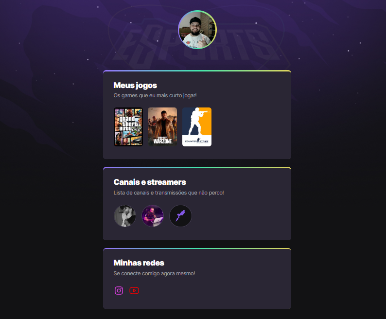

# NLW eSports 

>Trilha explorer

Projeto criado no Next Level Week (NLW) da Rocketseat!

[🔗​ Clique aqui para acessar](https://FilipemedeiroDev.github.io/nlw)

## 🛠️​ Tecnologias

- HTML
- CSS
- Git e Github

## ​📢 Considerações
----
Projeto simples porém foi divertido aplicar esses conceitos básicos de HTML e CSS e perceber como dá pra construir muita coisa legal, de forma simples e fácil e que qualquer um pode se desafiar e se aventurar nessa área.